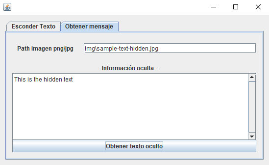

  

<h3 align="center">Hide messages inside images</h3>

    
    

---

Hide messages inside images using this steganography application.

## 🧐 Descripción

El programa realizado esconderá en una imagen .png o .jpg una cadena de texto. Se ha utilizado la técnica "*least significant bit*”.

En el código fuente de la aplicación (carpeta `src`) se puede ver una explicación detallada de lo que se ha ido haciendo.

## 🎈 Modo de uso
Ejecutar el fichero ejecutable `estaganografia.jar`.

Se va a ocultar un texto en la siguiente imagen:

Se especifican las rutas de las imágenes (izquierda) y la foto resultante que tiene el texto oculto (derecha) sigue siendo igual que la original.

Se especifican la ruta de la imagen que tiene el mensaje oculto (izquierda) y se obtiene de forma correcta el mensaje.

